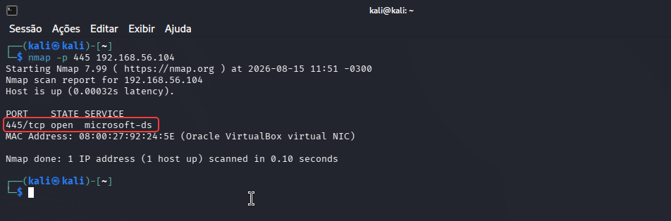
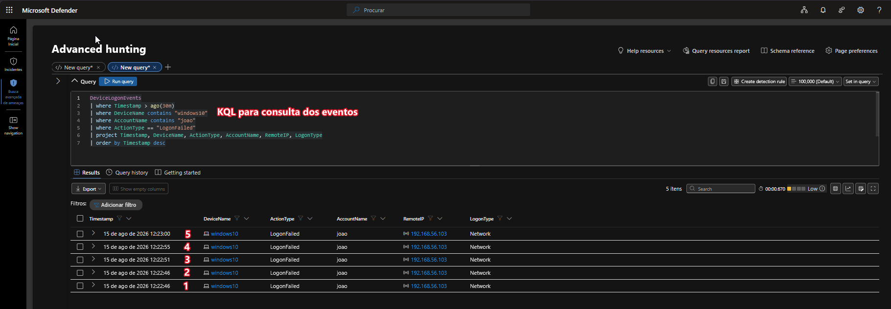
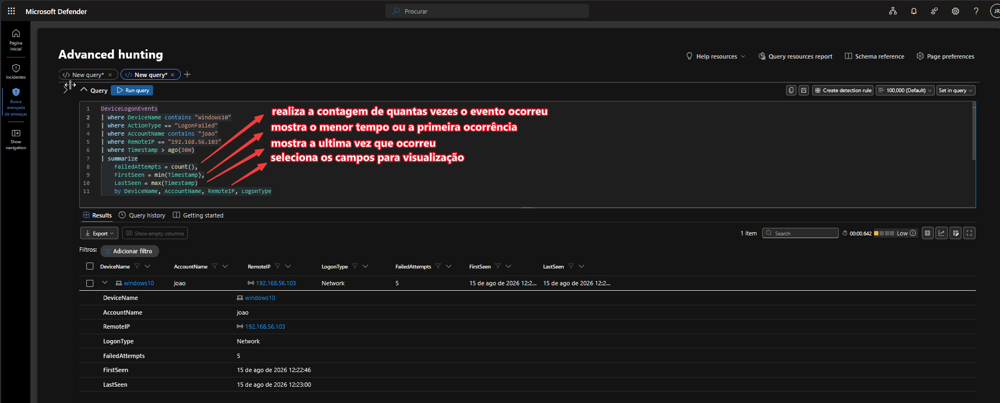
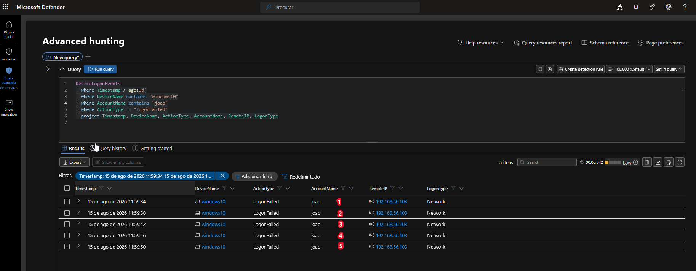
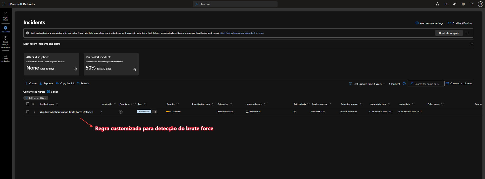
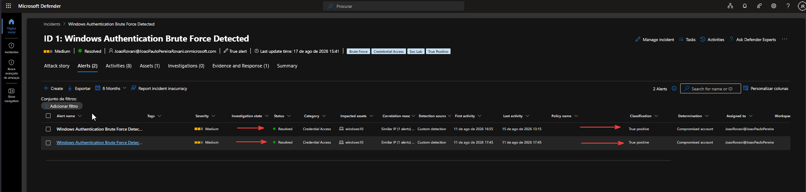

# RovaniSec — Windows Authentication Brute Force Detection Lab

> Laboratório prático de Blue Team / SOC desenvolvido para simular, detectar e investigar tentativas de força bruta contra autenticação Windows utilizando SMB e Microsoft Defender XDR.

---

## 📌 Sobre o Projeto

Este projeto apresenta a construção de um laboratório de segurança defensiva focado na detecção e investigação de tentativas de força bruta contra um endpoint Windows.

A atividade foi realizada em um ambiente virtualizado e controlado, utilizando o Kali Linux como origem da atividade e um endpoint Windows como alvo.

O objetivo foi reproduzir um fluxo próximo ao processo operacional de um SOC, passando pelas etapas de:

- Reconhecimento;
- Enumeração de serviços;
- Simulação de tentativas de autenticação;
- Geração de telemetria;
- Investigação utilizando Advanced Hunting;
- Desenvolvimento de lógica de detecção;
- Criação de uma Custom Detection;
- Geração e investigação de um incidente;
- Classificação da atividade;
- Encerramento do incidente;
- Mapeamento para MITRE ATT&CK.

---

## 🎯 Objetivo

O objetivo principal deste laboratório é demonstrar, de forma prática, o ciclo completo de uma detecção de segurança:

```text
Simulação
    ↓
Telemetria
    ↓
Hunting
    ↓
Detecção
    ↓
Alerta
    ↓
Incidente
    ↓
Investigação
    ↓
Classificação
    ↓
Resposta
    ↓
Encerramento
```

O cenário foi construído para demonstrar competências relacionadas a Blue Team, SOC N1, Threat Detection, análise de autenticação Windows, KQL e Microsoft Defender XDR

---
## Arquitetura

O laboratório utiliza um ambiente virtualizado e isolado para reproduzir a comunicação entre uma máquina de origem e um endpoint Windows.

| Componente                      | Função                                 |
| ------------------------------- | -------------------------------------- |
| Kali Linux                      | Origem da atividade simulada           |
| Windows 10                      | Endpoint alvo                          |
| SMB                             | Serviço utilizado na simulação         |
| Microsoft Defender for Endpoint | Coleta de telemetria do endpoint       |
| Microsoft Defender XDR          | Investigação e detecção                |
| Advanced Hunting                | Investigação da telemetria             |
| KQL                             | Linguagem utilizada nas consultas      |
| Custom Detection                | Detecção automatizada do comportamento |
| MITRE ATT&CK                    | Classificação da técnica observada     |


### Fluxo

```text

┌──────────────┐
│  Kali Linux  │
│    Atacante  │
└──────┬───────┘
       │
       │ SMB / TCP 445
       │
       ▼
┌──────────────┐
│  Windows 10  │
│    Endpoint  │
└──────┬───────┘
       │
       │ Telemetria
       ▼
┌───────────────|
│ Microsoft Defender XDR  │
│                         │
│ Advanced Hunting        │
│ KQL                     │
│ Custom Detection        │
│ Incident Investigation  │
└───────────────|
```
A descrição detalhada da arquitetura está disponível em:

[📄 Ver documentação da arquitetura](docs/architecture.md)

---

⚔️ Simulação do Ataque

A simulação foi realizada a partir do Kali Linux contra o serviço SMB disponível no endpoint Windows.

O objetivo não foi comprometer o sistema, mas gerar um conjunto controlado de tentativas de autenticação malsucedidas para produzir telemetria e validar a capacidade de detecção.

## 1. Reconhecimento e Enumeração SMB

Inicialmente foi realizada uma verificação do endpoint para identificar serviços expostos.

Foi utilizado o Nmap para verificar a porta TCP/445.

Evidência — Enumeração SMB




A enumeração identificou o serviço:
```text
445/tcp open microsoft-ds
```
A porta TCP/445 está associada ao protocolo SMB utilizado pelo Windows para compartilhamento de arquivos e outros mecanismos de comunicação.

---

## 2. Simulação de Tentativas de Autenticação

Após identificar o serviço SMB, foram realizadas múltiplas tentativas de autenticação contra o endpoint Windows utilizando credenciais inválidas.

Evidência — Ataque SMB


As tentativas foram realizadas de forma controlada com o objetivo de gerar eventos de falha de autenticação no endpoint.

A atividade simulada representa o comportamento que a detecção posteriormente deverá identificar.

A descrição completa da simulação está disponível em:


---

## 🔎 Investigação e Hunting

Após a execução da simulação, a investigação foi realizada utilizando o Microsoft Defender XDR, através do recurso Advanced Hunting.

A tabela utilizada para investigação foi:

```text
DeviceLogonEvents
```
O objetivo inicial foi identificar os eventos relacionados a falhas de autenticação.

---

3. Identificação de LogonFailed

A primeira etapa da investigação consistiu em consultar os eventos de autenticação malsucedida.

O filtro principal utilizado foi:
```text
ActionType == "LogonFailed"
```
Evidência — Consulta KQL




Essa etapa permitiu confirmar que as tentativas realizadas durante a simulação estavam sendo registradas pela telemetria do Defender.

---

## 📊 Correlação das Tentativas

Após identificar os eventos individuais de falha, foi necessário determinar se existia um padrão de múltiplas tentativas associado ao mesmo contexto.

Para isso, os eventos foram agregados utilizando summarize.

A lógica considerou principalmente:

```text
DeviceName
AccountName
RemoteIP
LogonType
```

e calculou a quantidade de falhas:

```text
FailedAttempts
```
Evidência — Contagem dos eventos




---

## 🚨 Lógica de Detecção

Com a consulta validada no Advanced Hunting, foi definida uma lógica de detecção para identificar múltiplas falhas de autenticação dentro de uma janela de tempo.

Critério utilizado
```text
Threshold: ≥5 falhas de autenticação no mesmo contexto dentro de 2 minutos.
```

considerando o mesmo contexto de:

```text
Device
+
Account
+
Remote IP
+
Logon Type
```

Esse limite foi utilizado para diferenciar uma sequência de tentativas de autenticação potencialmente maliciosas de uma falha isolada de login.

---

## 🛡️ Custom Detection

Após validar a lógica no Advanced Hunting, a consulta foi transformada em uma Custom Detection no Microsoft Defender XDR.

Essa etapa representa a transição entre:

```text
Hunting manual
      ↓
Lógica de detecção
      ↓
Custom Detection
      ↓
Alerta automatizado
```

Evidência — Criação da detecção




A detecção foi configurada para gerar um alerta quando o padrão de múltiplas falhas de autenticação fosse identificado.

---

## ⚙️ Regra Custom Detection

A regra criada no Defender XDR recebeu o nome:

```text
Windows Authentication Brute Force - Multiple Failed Logons
```

O alerta gerado pela regra foi definido como:

```text
Windows Authentication Brute Force Detected
```
Evidência — Regra configurada




A configuração da regra permitiu transformar a lógica desenvolvida durante o Hunting em um mecanismo persistente de detecção.

---

## 🚨 Geração do Incidente

Após a criação da Custom Detection, a atividade foi executada novamente para validar o funcionamento da detecção.

O Microsoft Defender XDR identificou o padrão de múltiplas falhas e gerou o alerta:

```text
Windows Authentication Brute Force Detected
```

O alerta foi associado a um incidente no Defender XDR.

Durante a investigação, foram observadas informações como:

| Campo           | Valor observado |
| --------------- | --------------- |
| Device          | windows10       |
| Account         | joao            |
| Remote IP       | 192.168.56.103  |
| Logon Type      | Network         |
| Failed Attempts | 5               |

Essas informações permitiram estabelecer a relação entre:

```text
Endpoint
   ↓
Conta
   ↓
IP de origem
   ↓
Múltiplas falhas de autenticação
```

---

## 🕵️ Investigação do Incidente

A investigação foi conduzida seguindo uma abordagem de triagem compatível com um fluxo de SOC N1.

Foram analisados:

Endpoint afetado;
Conta envolvida;
Endereço IP de origem;
Tipo de logon;
Quantidade de tentativas;
Eventos relacionados;
Evidências associadas ao alerta;
Contexto da atividade;
Origem da simulação.

A investigação confirmou que o endereço IP identificado como origem da atividade correspondia ao host Kali Linux utilizado no laboratório.

Como a atividade foi intencionalmente gerada durante a simulação, o alerta foi classificado como:

```text
True Positive
```
É importante destacar que True Positive significa que a detecção identificou corretamente a atividade para a qual foi projetada. Neste laboratório, isso não significa que houve comprometimento do endpoint.

---

🧠 Classificação

A classificação do incidente considerou dois aspectos:

Detecção

A regra detectou corretamente o padrão esperado:

```text
5 falhas de autenticação
+
mesmo contexto
+
mesmo IP
```

Portanto:

```text
True Positive
```
Contexto

A atividade foi gerada intencionalmente dentro de um laboratório controlado.

Não foram identificadas evidências de:

```text
  Autenticação bem-sucedida;
  Comprometimento do endpoint;
  Persistência;
  Execução maliciosa após autenticação;
  Exfiltração de dados.
```

Dessa forma, não foi necessária uma ação de contenção sobre o endpoint.

---

🛡️ Resposta ao Incidente

O processo de resposta foi baseado na análise das evidências disponíveis no Microsoft Defender XDR.

Fluxo de decisão
```text
Alerta
  ↓
Triagem
  ↓
Validação da atividade
  ↓
Análise do IP de origem
  ↓
Análise da conta
  ↓
Análise dos eventos
  ↓
Confirmação da simulação
  ↓
True Positive
  ↓
Sem comprometimento confirmado
  ↓
Sem contenção necessária
  ↓
Resolved
```
O processo detalhado de investigação e resposta está documentado em:

[📘Incident Response](docs/incident-response.md)

✅ Encerramento do Incidente

Após a conclusão da investigação, o incidente foi encerrado como:

```text
Resolved
```
Evidência — Incidente encerrado




O encerramento representa a conclusão do ciclo de investigação realizado no laboratório.

---

🧭 MITRE ATT&CK

A atividade simulada foi mapeada principalmente para a técnica:

T1110 — Brute Force

Tática: Credential Access

A técnica T1110 — Brute Force representa tentativas de obter acesso através da repetição de tentativas de autenticação.

No laboratório, o comportamento foi reproduzido através de múltiplas tentativas de autenticação contra o serviço SMB do endpoint Windows.

O mapeamento detalhado está disponível em:

[🧭 Mitre ATT&CK](docs/mitre-mapping.md)

---

📚 Documentação do Projeto

A documentação técnica foi dividida em cinco documentos para evitar concentrar todas as informações no README.

🏗️ Arquitetura

[ARQUITETURA](docs/architecture.md)

Apresenta a arquitetura do laboratório, seus componentes e o fluxo de comunicação.

⚔️ Simulação de Ataque

[Simulação do ataque](docs/attack-simulation.md)

Documenta as etapas utilizadas para reproduzir a atividade contra o serviço SMB.

🔎 Análise de Detecção

[Análise do SOC](docs/detection-analysis.md)

Apresenta a lógica de detecção, consultas KQL, threshold, fontes de dados, evidências e indicadores.

🛡️ Resposta ao Incidente

[Resposta ao Incidente](docs/incident-response.md)

Documenta o processo de investigação, classificação, tomada de decisão e encerramento do incidente.

🧭 MITRE ATT&CK

[Correlação MITRE ATT&CK](docs/mitre-mapping.md)

Apresenta o mapeamento da atividade observada para as técnicas do MITRE ATT&CK.

---

🧰 Tecnologias e Ferramentas
```text
Kali Linux
Windows 10
Microsoft Defender for Endpoint
Microsoft Defender XDR
Advanced Hunting
KQL
SMB
Nmap
VirtualBox
MITRE ATT&CK
```

---

🎓 Competências Demonstradas

Este laboratório demonstra conhecimentos práticos em:

```text
Blue Team;
SOC N1;
Threat Detection;
Security Monitoring;
Análise de autenticação Windows;
Análise de eventos de segurança;
Microsoft Defender XDR;
Microsoft Defender for Endpoint;
Advanced Hunting;
KQL;
Detection Engineering;
Custom Detection;
Investigação de incidentes;
Incident Response;
MITRE ATT&CK;
Triagem de alertas;
Classificação de incidentes;
Análise de evidências.
```
---

🔐 Segurança do Laboratório

Todas as atividades foram realizadas em um ambiente virtualizado e controlado.

O tráfego e as tentativas de autenticação foram direcionados exclusivamente aos hosts pertencentes ao laboratório.

Nenhum sistema de terceiros foi utilizado como alvo das atividades descritas neste projeto.

---

👤 Autor
João Rovani

Estudante de Segurança da Informação | Blue Team | SOC | Microsoft Defender XDR

GitHub: https://github.com/Rovani-Sec/
LinkedIn: www.linkedin.com/in/joaorovani-sec

---
📌 Resumo do Fluxo

```text
Kali Linux
     │
     │ Nmap
     ▼
Enumeração SMB
     │
     ▼
Tentativas de autenticação
     │
     ▼
Windows Endpoint
     │
     │ Telemetria
     ▼
DeviceLogonEvents
     │
     ▼
Advanced Hunting
     │
     ▼
KQL
     │
     ▼
5+ falhas
     │
     ▼
Custom Detection
     │
     ▼
Alert
     │
     ▼
Incident
     │
     ▼
SOC Investigation
     │
     ▼
True Positive
     │
     ▼
Resolved
```

⭐ Projeto desenvolvido como laboratório prático de Blue Team / SOC com foco em detecção e investigação de ataques de força bruta contra autenticação Windows.
